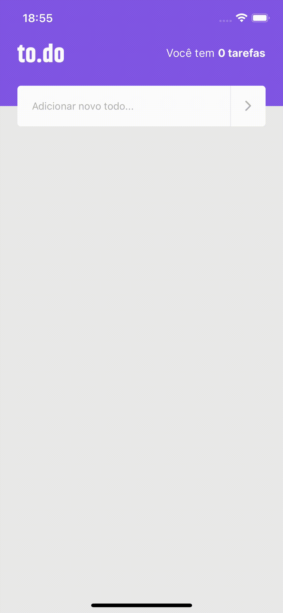

# to.do &middot;    

  

 

## 🖥 Functionalities
- TODO tasks count
- Add a TODO task
- Edit a TODO task
- Remove a TODO task
- Mark a TODO task as finished

 

## 🔖 Layout

Check Figma Layout of this project [here](https://www.figma.com/file/L442P4syOkbHGaLr4fGad4/to.do/duplicate)

 

## 📝 License

MIT License © Yuri Paiva. Check [LICENSE](LICENSE) for more details

 

Made with 💜 &nbsp;by Yuri Paiva